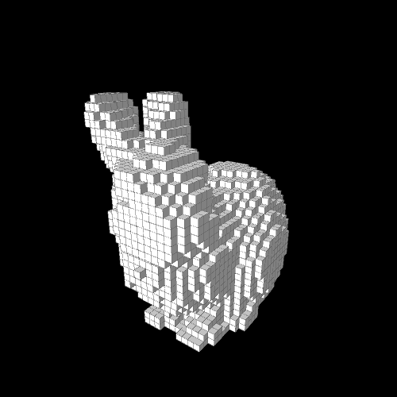

# binvox renderer
binvox renderer in Processing version 3.0.2 or later.<br><br>

## Getting started
1. download the zip file
2. open ```binvox_renderer.pde``` in Processing
3. run the code, and you are asked to select a folder in which binvox files are located
4. the code saves renderings and obj files automatically
